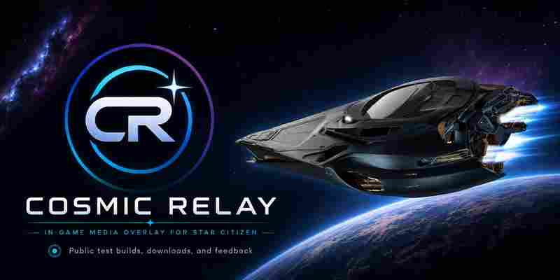

  

  <strong>Status:</strong> Alpha
  &nbsp;•&nbsp;
  <strong>Platform:</strong> Windows x64
  &nbsp;•&nbsp;
  <strong>Source:</strong> Private

<!-- AUTO_HERO_RELEASE_START -->

  

  <strong>Current tester build:</strong> <code>v0.7.0-alpha.4</code>

<!-- AUTO_HERO_RELEASE_END -->

  
  
  

---

## About Cosmic Relay

**Cosmic Relay is a lightweight, customizable in-game media overlay for Star Citizen — built to keep your currently playing media visible without pulling you out of the cockpit.**

It runs externally on Windows and is designed to blend naturally into a Star Citizen setup while keeping media information and controls close at hand.

> **Website:** `cosmicrelay.app` — **coming soon.** The domain is reserved for the future Cosmic Relay landing page but is not active yet.

This public repository is the home for **tester downloads, release notes, bug reports, and quality-of-life feedback**. The application source code is maintained separately in a private repository and is **not distributed here**.

## Current features

- Three overlay layouts: **Full**, **Flight**, and **Ghost**
- `AUTO`, `SPOT`, and `WEB` source modes, plus optional pinning to a specific Windows media session
- Spotify, YouTube, browser media, and other compatible Windows media-session playback detection
- Album artwork with an optional **Show album artwork** preference
- Track title, artist, playback state, progress timeline, and seeking when supported
- Previous, play/pause, next, shuffle, and repeat controls when exposed by the active media session
- Per-application volume and mute controls
- Overlay scaling from 80% to 160%, adjustable background opacity, reduced motion, and configurable long-title marquee behavior
- Click-through locking with a configurable global lock/unlock hotkey
- Configurable global show/hide hotkey
- Movable overlay with Settings-window anchoring, manual offset preservation, and monitor-edge-aware placement
- System tray controls and optional **Launch with Windows**
- **Copy Diagnostics** for media-session, capability, timeline, artwork, hotkey, and environment troubleshooting
- Public alpha builds for Windows x64

Cosmic Relay is still in active alpha development. Real-world tester feedback is helping determine which media services, usability improvements, and quality-of-life features are added next.

<!-- AUTO_RELEASE_START -->
## Download

**Cosmic Relay v0.7.0-alpha.4 — QOL & Diagnostics is now available.**

➡️ **[Open the current Cosmic Relay release](https://github.com/Lordkoii/Cosmic-Relay/releases/tag/v0.7.0-alpha.4)**

Download `CosmicRelay-v0.7.0-alpha.4-win-x64.zip` from the release assets, extract the entire ZIP to a folder, and run `CosmicRelay.exe`.

This is a self-contained Windows x64 build, so a separate .NET installation should not be required.

Only download Cosmic Relay from releases published by **Lordkoii**.

> Cosmic Relay is currently alpha software. Test builds may contain bugs or incomplete features. Because the application is not yet code-signed, Windows may display an unknown-publisher or security warning on some systems.

### File verification

SHA-256 for `CosmicRelay-v0.7.0-alpha.4-win-x64.zip`:

`357ad56d8dce166a425d8a133bc2ed7a4111f6260cd605cc31cb5b158ccd4a5d`
<!-- AUTO_RELEASE_END -->

### Windows first launch

Current alpha builds are not yet digitally code-signed, so Windows may mark the downloaded ZIP or application as coming from the Internet.

For the smoothest first launch:

1. Download the ZIP from the official Cosmic Relay GitHub Release.
2. Before extracting it, right-click the ZIP and select **Properties**.
3. If an **Unblock** checkbox appears near the bottom of the Properties window, check it, select **Apply**, then **OK**.
4. Extract the entire ZIP to a folder.
5. Run `CosmicRelay.exe`.

If Microsoft Defender SmartScreen displays **Windows protected your PC**, verify that you downloaded the file from the official **Lordkoii/Cosmic-Relay** release page and that the SHA-256 matches the value above. On systems where Windows offers the option, select **More info** and then **Run anyway**.

Digitally signed builds are planned for a future release.

## Help test Cosmic Relay

Feedback is one of the main reasons this public repository exists.

**Found a bug?** Use the [Bug Report](https://github.com/Lordkoii/Cosmic-Relay/issues/new?template=bug_report.yml) form and include what you were doing, the media source/player, whether Cosmic Relay was using `AUTO`, `SPOT`, `WEB`, or a pinned session, reproduction steps, and screenshots when useful. **Copy Diagnostics** output is especially helpful for media-detection problems; review it before posting because it can include the current track title, artist, and raw Windows media-session identifier.

**Have a QOL or feature idea?** Use the [QOL / Feature Suggestion](https://github.com/Lordkoii/Cosmic-Relay/issues/new?template=qol_suggestion.yml) form. Small usability ideas are especially valuable during alpha testing.

## Safety & privacy

Cosmic Relay is designed as an **external companion application**.

It does not intend to:

- inject DLLs or code into Star Citizen
- read Star Citizen process memory
- intercept or manipulate game/network traffic
- automate keyboard, mouse, or gameplay actions
- modify Star Citizen client files

Cosmic Relay reads compatible Windows media-session information so it can display playback details and expose supported media controls.

**Local-first:** preferences and diagnostics remain on the user's PC unless the user explicitly copies or shares them. Diagnostics should be reviewed before posting because they may include the current track title, artist, and raw Windows media-session identifier.

## Security

Security-sensitive findings should **not** be reported through a public issue.

Please review [`SECURITY.md`](SECURITY.md) for the private-reporting process, supported-version guidance, scope, and privacy expectations for security reports.

## License and distribution

Cosmic Relay is **proprietary software**. It is not open source.

Copyright © 2026 **Lordkoii**. All rights reserved.

Official compiled releases may be downloaded, installed, and used for personal, non-commercial evaluation and personal use under the terms in [`LICENSE`](LICENSE).

The application source code is maintained privately and is not licensed for public reuse, modification, or redistribution.

Redistribution, resale, repackaging, rebranding, or claiming Cosmic Relay as your own work is not permitted.

Third-party components included with official builds remain subject to their respective licenses and notices. See [`THIRD-PARTY-NOTICES.txt`](THIRD-PARTY-NOTICES.txt) where provided.

## Star Citizen disclaimer

Cosmic Relay is an independent, unofficial fan-made utility and is not affiliated with, endorsed by, or sponsored by Cloud Imperium Games or Roberts Space Industries. Star Citizen and related marks belong to their respective owners.

## Creator

Created and maintained by **Lordkoii**.

Thanks for testing Cosmic Relay and helping shape what comes next.
